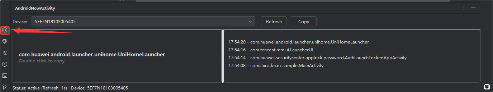
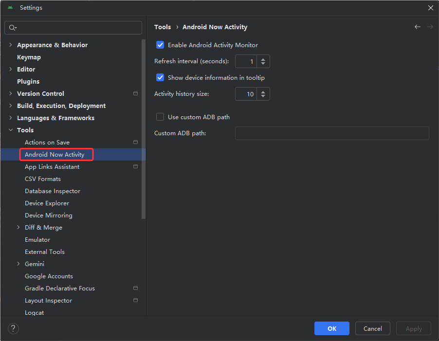

# Android Now Activity Plugin

[](https://plugins.jetbrains.com/plugin/28386-android-now-activity)
[](https://plugins.jetbrains.com/plugin/28386-android-now-activity)
[](LICENSE)
[](https://developer.android.com/studio)
[](https://github.com/Txca/AndroidNowActivityPlugin)

## ✅ 项目说明
该项目完全由[Trae](https://www.trae.ai/)开发，我最初的目的有两个，一是了解下现代AI IDE的实际能力，二是自己也的确需要这么一个小插件。除了这一段项目说明及图片部分，**整个项目**包括该`README`的剩余部分，均由[Trae](https://www.trae.ai/)独立完成(非SOLO模式，因为没排上队)。我本人没有任何 IDEA 插件开发经验，整个过程大约花了 10 轮左右的对话，涵盖了功能实现、UI 修改以及功能完善等环节。

## 📱 功能介绍

Android Now Activity 是一个 Android Studio 插件，用于实时显示当前连接设备上正在运行的 Activity。该插件提供了直观的工具窗口界面，帮助开发者快速了解应用的 Activity 状态。

### 🎯 主要功能

- **实时Activity监控**：自动检测并显示当前前台Activity
- **多设备支持**：支持同时连接多个Android设备
- **Activity历史记录**：显示最近访问的Activity列表（可配置数量）
- **一键复制**：单击复制Activity简名，双击复制完整类名
- **主题自适应**：自动适配IDE的深色/浅色主题
- **可配置设置**：刷新间隔、历史记录数量等可自定义

### 🖥️ 界面预览

#### 主界面 - 工具窗口


#### 设置界面 - 配置选项


**界面说明：**
- **左侧面板**：显示当前Activity，支持单击复制简名、双击复制完整类名
- **右侧面板**：显示Activity历史记录，带时间戳和完整包名
- **顶部工具栏**：设备选择下拉菜单、刷新按钮、复制按钮
- **底部状态栏**：显示插件状态、刷新间隔和当前设备信息
- **圆角设计**：自适应IDE主题的现代化UI界面

## 🏗️ 架构设计

### 核心组件

```
┌─────────────────────────────────────────────────────┐
│                   Plugin Architecture               │
├─────────────────────────────────────────────────────┤
│  ActivityToolWindowFactory                          │
│  ├── ActivityToolWindow (主界面)                    │
│  │   ├── RoundedPanel (圆角面板)                    │
│  │   ├── Device Selection (设备选择)                │
│  │   ├── Current Activity Display (当前Activity)    │
│  │   └── Activity History List (历史记录)           │
│  │                                                  │
│  ├── AdbUtils (ADB工具类)                          │
│  │   ├── Device Detection (设备检测)                │
│  │   ├── Activity Extraction (Activity获取)         │
│  │   └── Command Execution (命令执行)               │
│  │                                                  │
│  └── ActivityMonitorSettings (设置管理)             │
│      ├── Refresh Interval (刷新间隔)                │
│      ├── History Size (历史记录数量)                │
│      └── ADB Path Configuration (ADB路径配置)       │
└─────────────────────────────────────────────────────┘
```

### Activity获取逻辑

插件采用多层级兼容性策略，按优先级尝试不同的获取方法：

1. **基础连接测试** - 验证ADB连接状态
2. **窗口信息获取** - `dumpsys window windows` (推荐)
3. **Activity栈分析** - `dumpsys activity activities`
4. **顶层Activity** - `dumpsys activity top`
5. **AM命令方式** - `am stack list` (Android 10+)
6. **日志分析方式** - `logcat ActivityManager`
7. **最近记录** - `dumpsys activity recents`

### 兼容性矩阵

| Android版本 | 主要获取方法 | 备用方法 | 兼容性 |
|------------|------------|----------|--------|
| Android 15+ | 窗口信息 + AM命令 | 传统dumpsys | ✅ 优秀 |
| Android 12-14 | 窗口信息 + 传统dumpsys | AM命令 + 日志 | ✅ 良好 |
| Android 10-11 | 传统dumpsys + AM命令 | 窗口信息 | ✅ 良好 |
| Android 8-9 | 传统dumpsys | 多重备用 | ✅ 基本 |
| Android 7及以下 | 传统dumpsys | 有限支持 | ⚠️ 有限 |

## 🛠️ 编译和安装

### 环境要求

- **JDK**: 17 或更高版本
- **Android Studio**: 2023.2 (Build 223) 或更高版本
- **Gradle**: 7.6+ (项目自带)
- **Kotlin**: 1.9+

### 编译步骤

1. **克隆项目**
   ```bash
   git clone <repository-url>
   cd AndroidNowActivity
   ```

2. **编译插件**
   ```bash
   # Windows
   .\gradlew.bat buildPlugin
   
   # macOS/Linux
   ./gradlew buildPlugin
   ```

3. **生成的插件文件**
   ```
   build/distributions/AndroidNowActivity-1.0.5.zip
   ```

### 安装方法

#### 方法一：通过文件安装
1. 打开 Android Studio
2. 进入 `File` → `Settings` → `Plugins`
3. 点击齿轮图标 → `Install Plugin from Disk...`
4. 选择编译生成的 `.zip` 文件
5. 重启 Android Studio

#### 方法二：开发模式安装
1. 在项目根目录运行：
   ```bash
   ./gradlew.bat runIde
   ```
2. 会启动一个带有插件的新 Android Studio 实例

## 🚀 使用方法

### 基本使用

1. **打开工具窗口**
   - 方式一：`View` → `Tool Windows` → `Android Activity`
   - 方式二：点击底部工具栏的 `Android Activity` 标签

2. **连接设备**
   - 确保设备已开启USB调试
   - 在设备下拉菜单中选择目标设备

3. **查看Activity信息**
   - 左侧显示当前Activity（加粗显示）
   - 右侧显示Activity历史记录（带时间戳）

4. **复制Activity名称**
   - **单击**当前Activity：复制简短名称（如 `MainActivity`）
   - **双击**当前Activity：复制完整名称（如 `com.example.app.MainActivity`）
   - **双击**历史记录：复制完整Activity名称

### 高级配置

1. **打开设置**
   - `File` → `Settings` → `Tools` → `Android Now Activity`

2. **可配置选项**
   - **启用/禁用插件**：控制插件是否工作
   - **刷新间隔**：设置Activity检测频率（1-60秒）
   - **显示设备信息**：在提示中显示设备详细信息
   - **Activity历史数量**：设置历史记录保存数量（5-50个）
   - **自定义ADB路径**：手动指定ADB可执行文件路径

## 🔧 故障排除

### 常见问题

**Q: 插件显示"No Device"**
- 检查设备是否正确连接
- 确认USB调试已开启
- 运行 `adb devices` 验证设备连接

**Q: 插件显示"No Activity"**
- 确保设备上有应用正在运行
- 检查应用是否在前台显示
- 尝试点击刷新按钮

**Q: ADB路径错误**
- 在设置中配置正确的ADB路径
- 通常位于：`<Android SDK>/platform-tools/adb`

**Q: 权限问题**
- 确保ADB有执行权限
- 在设备上确认USB调试授权

### 调试信息

如需查看详细的调试信息：
1. 打开 `Help` → `Show Log in Explorer`
2. 在日志文件中搜索 `AndroidNowActivity`
3. 查看具体的错误信息和执行过程

## 📄 许可证

本项目采用 MIT 许可证。详见 [LICENSE](LICENSE) 文件。

## 🤝 贡献

欢迎提交 Issue 和 Pull Request 来改进这个插件！

### 开发环境设置

1. 导入项目到 IntelliJ IDEA
2. 确保使用 JDK 17+
3. 运行 `./gradlew.bat runIde` 启动开发环境
4. 修改代码后重新编译测试

---

**享受更高效的Android开发体验！** 🎉